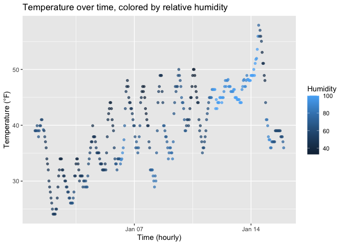

p8105_hw1_yw4662
================

## Problem 1

### Setup

``` r
library(moderndive) # load the moderndive dataset
library(ggplot2) # load plotting
data("early_january_weather") #load the early_january_weather dataset from moderndive data
```

### Short description of the dataset

This dataset contains hourly weather observations for NYC airports over
early January.

- **Time span**: from 2013-01-01 01:00 to 2013-01-15 23:00.

- **Size**: 358 rows $\times$ 15 columns.

- **Variables**: origin, year, month, day, hour, temp, dewp, humid,
  wind_dir, wind_speed, wind_gust, precip, pressure, visib, time_hour.

- **Mean air temperature**: 39.6°F

### Scatterplot: `temp` vs `time_hour`, colored by `humid`

``` r
ggplot(early_january_weather,
            aes(x = time_hour, y = temp, color = humid)) +
  geom_point(alpha = 0.7, size = 1.3) +
  labs(
    title = "Temperature over time, colored by relative humidity",
    x = "Time (hourly)",
    y = "Temperature (°F)",
    color = "Humidity"
  )
```

<!-- -->

### Brief description of patterns

Temperatures fluctuate in daily cycles, generally cooler overnight and
warmer during daytime. Points with lower humidity (darker colors) tend
to appear during cooler periods, suggesting a direct relationship
between temperature and relative humidity.

``` r
ggsave(
  filename = "temp_vs_time_hour_by_humid.png"
)
```

    ## Saving 7 x 5 in image

## Problem 2

### Setup

``` r
knitr::opts_chunk$set(echo = TRUE, message = FALSE, warning = FALSE)
library(tidyverse)
```

    ## ── Attaching core tidyverse packages ──────────────────────── tidyverse 2.0.0 ──
    ## ✔ dplyr     1.1.4     ✔ readr     2.1.5
    ## ✔ forcats   1.0.0     ✔ stringr   1.5.1
    ## ✔ lubridate 1.9.4     ✔ tibble    3.3.0
    ## ✔ purrr     1.1.0     ✔ tidyr     1.3.1
    ## ── Conflicts ────────────────────────────────────────── tidyverse_conflicts() ──
    ## ✖ dplyr::filter() masks stats::filter()
    ## ✖ dplyr::lag()    masks stats::lag()
    ## ℹ Use the conflicted package (<http://conflicted.r-lib.org/>) to force all conflicts to become errors

### Creating the data frame

``` r
# random sample of size 10 from a standard Normal distribution
num <- rnorm(10)

# logical vector indicating whether elements of the sample are greater than 0
logic_0 <- num > 0

# character vector of length 10: a,...,j
char_10 <- letters[1:10]

# factor vector of length 10 with 3 different factor levels
factor_3levels <- factor(sample(c("low", "medium", "high"),
                       size = 10, replace = TRUE),
                levels = c("low", "medium", "high"),
                ordered = TRUE)       

df <- tibble(num, logic_0, char_10, factor_3levels)
df
```

    ## # A tibble: 10 × 4
    ##       num logic_0 char_10 factor_3levels
    ##     <dbl> <lgl>   <chr>   <ord>         
    ##  1 -0.746 FALSE   a       high          
    ##  2 -0.268 FALSE   b       high          
    ##  3 -0.855 FALSE   c       low           
    ##  4  0.957 TRUE    d       low           
    ##  5 -0.341 FALSE   e       low           
    ##  6  0.640 TRUE    f       low           
    ##  7 -1.19  FALSE   g       medium        
    ##  8  1.29  TRUE    h       medium        
    ##  9 -2.26  FALSE   i       medium        
    ## 10 -0.350 FALSE   j       medium

### Taking the mean of each variable

``` r
# For the numeric variable

mean(pull(df,num))
```

    ## [1] -0.3122397

``` r
# For the logical variable

mean(pull(df, logic_0))
```

    ## [1] 0.3

``` r
# For the character variable

mean(pull(df, char_10))
```

    ## [1] NA

``` r
# For the factor variable

mean(pull(df,factor_3levels))
```

    ## [1] NA

**What works/doesn’t work and why:**

- `num`: because it is numeric, its mean is defined
- `logic_0`: because logical values are internally `TRUE=1`, `FALSE=0`,
  its mean is essentially the proportion of `TRUE` and hence defined
- `char_10`: because characters are not numeric, it returns with an
  error (NA)
- `factor_3levels`: factors are stored as integers with labels, but
  `mean()` refuses because the class is `factor` not `numeric`, and
  hence it returns with an error (NA)

### Coercion with `as.numeric()`

``` r
num_logical <- as.numeric(df$logic_0)
num_character <- as.numeric(df$char_10)
num_factor <- as.numeric(df$factor_3levels)
```

**Explanations for what happens:**

- `as.numeric(logic_0)` returns `0/1`, which explains why
  `mean(logic_0)` works (the share of `TRUE`)
- `as.numeric(char_10)` returns `NA` with a warning, this is because
  characters don’t map to numbers
- `as.numeric(factor_3levels)` returns the codes of the factor levles
  (`low=1`, `medium=2`, `high=3`)
